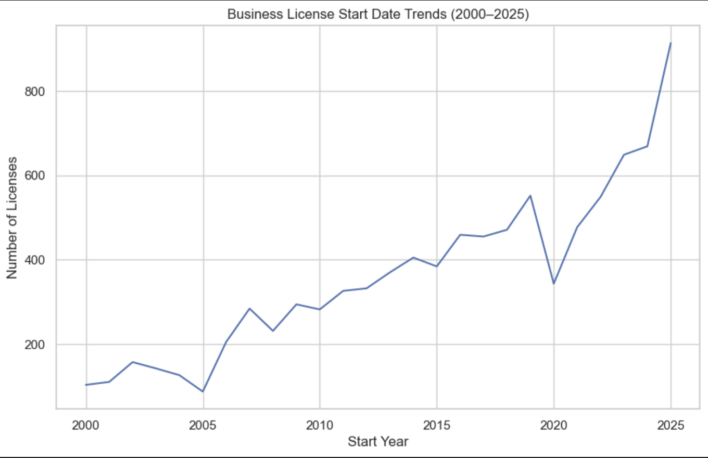

# New Orleans Business License Analysis
**Project Type:** Exploratory Data Analysis (EDA)  
**Dataset:** City of New Orleans Active Occupational Licenses  
**Tools:** Python, Pandas, Matplotlib, Seaborn, Folium, VS Code  
**Focus:** Identifying trends in business formation, industry distribution, and geographic clustering

## Project Overview

This project explores occupational business license data from New Orleans to identify trends in local business activity over time. 

The analysis examines how business openings evolve annually, seasonal patterns in openings, most common business types, and geophrphic clustering across the city. 

## Problem Statement
City planners, ecomonic analysts, and local policymakers often need to understand how business activity evolves across time and location.
Using business license data, this project investigates:
- Long-term trends in business openings.
- Seasonal patterns in business formation.
- Industry concentrations.
- Geographic clustering of new businesses.

Understanding these patterns can support economic planning, zoning considerations, and local development strategies. 

## Skills Demonstrated
- Exploratory data analysis (EDA)
- Data cleaning and transformation using Python
- Time-series trend analysis
- Industry and category aggregation
- Geospatial visualization using Folium
- Data visualization and insight communication

## Key Insights
- Business creation shows long-term growth with noticeable year-to-year
  variation.
- Q4 consistently shows elevated business formation, showing seasonal business
  planning and tourism influence.
- A small number of industries dominate new business registrations.
- New businesses tend to cluster within specific commercial zones and ZIP codes.

## Methodology

### Extract
The dataset was obtained from the City of New Orleans Active Occupational Licenses dataset. 

### Transform
Data preparation included:
- Column name normalization.
- Date parsing and formatting.
- ZIP code cleanup.
- Removal of incomplete records missing key identifiers.

### Load
The cleaned dataset was loaded into a working analysis environment for visualization and exploratory analysis. 

## Visualizations

### Business Starts Over Time (2000-2026)

This chart shows the number of new businesses started each year. It highlights long-term growth patterns and fluctuations in economic activity. 

### Top 10 Business Types in New Orleans

This chart shows which industries most frequently launch businesses during Q4.

### Geographic Density Map

This map illustrates where new businesses cluster across New Orleans. Brighter or larger areas indicate higher concentrations of business activity. 

## Tools & Technologies
- Python
- Pandas
- Matplotlib
- Seaborn
- Folium (Geospatial mapping)
- VS Code

## Dataset
- Source: City of New Orleans - Active Occupational Licenses
- Records: ~10,900 businesses
- Time Range: 2000-2026
- Granularity: Individual business license records

## Limitations & Future Improvements
- Expand analysis to include additional demographic or economic indicators.
- Compare business trends with tourism and economic data.
- Add interactive dashboards for exploration.
- Perform deeper industry-specific trend analysis.

## Live Interactive Site
Explore the interactive dashboards and maps here:
  
**[https://HCBrooks-lab.github.io/nola_occ_licenses25/](https://hcbrooks-lab.github.io/nola_occ_lic26/)**

## Author
H. Brooks

