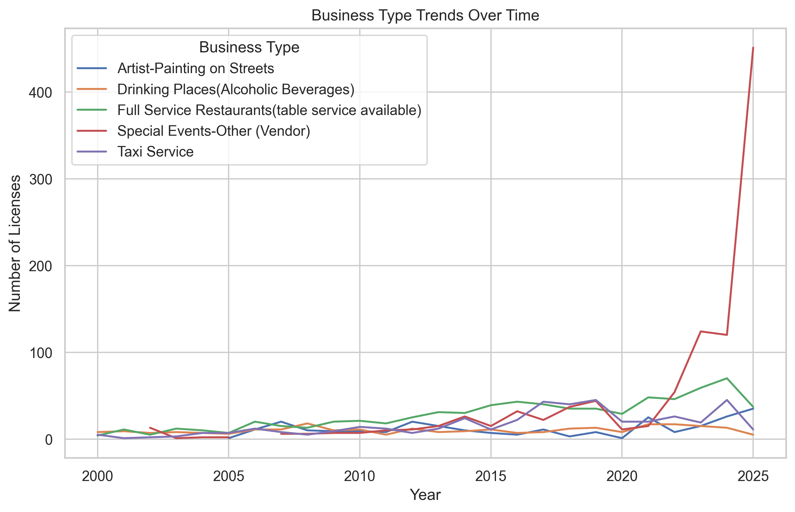
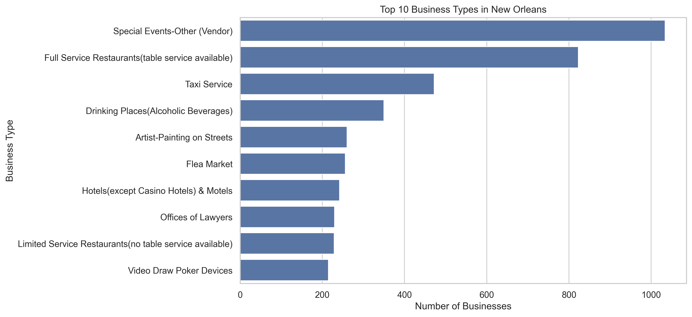
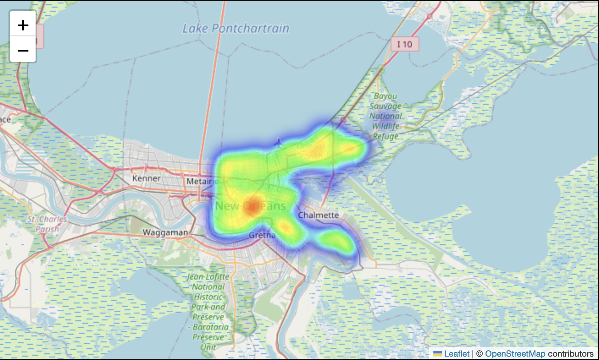

# New Orleans Business License Analysis

## Business Problem

City planners, economic analysts, and local stakeholders need to understand how business activity changes across time and geography to support economic development decisions.

This project analyzes active business license data from New Orleans to identify long-term growth trends, seasonal patterns, industry concentration, and geographic clustering.

## Key Findings

- Business license starts show sustained long-term growth with noticeable year-to-year variation.
- Q4 consistently demonstrates elevated business creation activity.
- Business activity is heavily concentrated within specific commercial zones and ZIP codes.
- Vendor and event-related business categories experienced notable growth in recent years.

## Interactive Project

[View Full Interactive Project (GitHub Pages)](https://hcbrooks-lab.github.io/nola_business_license_analysis/)

## Project Snapshot

This project analyzes approximately 10,900 active business license records using Python, Pandas, data visualization, and geospatial mapping. The dataset includes records through 2026, while time-based comparisons use complete years from 2000 through 2025.

## Project Overview

This project examines active business license records from New Orleans to understand how business activity changes across time, industry categories, and geographic areas.

Using time-series analysis, category aggregation, and geospatial visualization, the project explores when business formation increased, which business types were most common, and where licensed businesses were concentrated from 2000 through 2025.

## How I Approached the Analysis

- **Question:** I wanted to understand how licensed business activity changed across New Orleans from 2000 through 2025, including when activity increased, which business types were most common, and where businesses were concentrated.
- **Approach:** I cleaned and standardized the license records, then grouped them by starting year, quarter, business type, and location. I used trend charts, category comparisons, and maps so that each question could be examined in a format suited to the data.
- **Reasoning:** Yearly and quarterly totals reveal timing patterns that individual records cannot show. Grouping by business type shows whether activity is spread across many industries or concentrated in a smaller number, while mapping the records makes geographic clusters easier to identify.
- **Validation:** I reviewed record totals before and after cleaning, checked date and location fields for missing or incorrectly formatted values, and compared grouped totals with the underlying records. The incomplete 2026 period was excluded from time-based comparisons so that a partial year would not be compared with complete years.
- **Conclusion and limitations:** The results show when and where active business license records are concentrated, but they do not explain why the patterns occurred. Tourism, economic conditions, policy changes, and other outside factors would require additional data before drawing cause-and-effect conclusions.

## Recommendations

- Monitor commercial areas experiencing growth to help anticipate future zoning, infrastructure, and development needs.
- Review whether permitting resources should be adjusted during periods that have historically shown higher Q4 activity.
- Examine the recent growth of vendor and event-related categories to determine whether targeted business support or industry-specific planning may be useful.

## Skills Demonstrated

- Exploratory Data Analysis (EDA)
- Data Cleaning and Transformation (Python/Pandas)
- Time-Series Trend Analysis
- SQL Querying
- Business Category and Industry Analysis
- Geospatial Analysis and Mapping (Folium)
- Data Visualization and Storytelling
- Insight Development and Business Recommendations

## Methodology

The analysis followed a structured data preparation and exploration process:

- Collected active business license records from the City of New Orleans open data portal.
- Cleaned and standardized business, date, category, and location fields.
- Removed incomplete records and corrected formatting inconsistencies.
- Reviewed record counts and key fields to confirm that cleaning steps produced reasonable results.
- Excluded incomplete 2026 data from time-based comparisons.
- Performed time-series analysis to evaluate long-term and quarterly business opening trends.
- Aggregated business categories to identify the most common and fastest-growing types.
- Created geospatial visuals to examine business concentration across New Orleans.
- Developed static and interactive visuals to communicate the findings clearly.

## Tools & Technologies

- Python
- Pandas
- Matplotlib
- Seaborn
- Folium (Geospatial Analysis)
- SQL
- VS Code

## Visualizations

### Business Starts Over Time (2000–2025)

Business license starts demonstrate long-term growth across New Orleans despite periodic year-to-year fluctuations. The incomplete 2026 period was excluded so that every year in the comparison represents a complete reporting period.

---

### Top 10 Business Types in New Orleans

Business activity is concentrated within a relatively small number of categories. Comparing category totals helps identify which types of businesses have the strongest presence in the active license data.

---

### Geographic Distribution of Businesses

Licensed businesses are concentrated within key commercial corridors and ZIP code areas throughout New Orleans. Mapping the records makes these geographic clusters easier to recognize than reviewing individual addresses or ZIP codes in a table.

*View the interactive map on GitHub Pages:*  
[Open Interactive Business Density Map](https://hcbrooks-lab.github.io/nola_business_license_analysis/business_density_map.html)

## Dataset

- **Source:** City of New Orleans Active Occupational Licenses
- **Records:** Approximately 10,900 business license records
- **Dataset time range:** 2000–2026
- **Analysis time range:** 2000–2025
- **Granularity:** Individual business license records

## Limitations

- The dataset contains active occupational license records and may not represent every form of business or economic activity in New Orleans.
- The analysis identifies patterns and relationships but cannot determine what caused them.
- Incomplete or inconsistently formatted date and location fields may affect time-based and geographic results.
- The incomplete 2026 period was excluded from annual comparisons to prevent a partial year from being compared with complete years.

## Future Improvements

- Incorporate demographic and economic indicators to explore factors associated with business growth.
- Compare business formation trends with tourism, employment, and broader economic data.
- Expand the geographic analysis to evaluate activity by neighborhood and ZIP code.
- Conduct deeper industry-specific analysis to identify emerging business sectors.

## Author

H. Brooks
